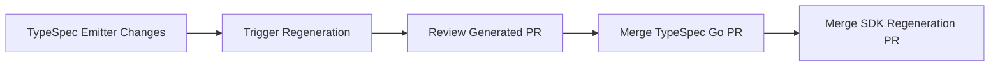

# SDK Regeneration Pipeline Guideline

This document provides a guideline about the SDK regeneration pipeline for TypeSpec Go emitter developers.

## Pipeline Overview

> **Pipeline Link**: [SDK Regeneration Pipeline](https://dev.azure.com/azure-sdk/internal/_build?definitionId=7860)

The SDK regeneration pipeline could regenerate Azure SDK for Go packages using any branch of TypeSpec Go emitter. This pipeline could validate emitter changes and ensures that SDK packages stay up-to-date with TypeSpec changes and emitter changes.

### Limitations

⚠️ **Management Plane Only**: This pipeline is currently designed exclusively for **management plane (resource manager) SDKs**. It does **not** support:
- Data plane SDKs
- Client libraries outside the `sdk/resourcemanager` directory
- Custom SDK implementations

### Pipeline Process
The SDK regeneration pipeline automates the process of updating Azure SDK packages with the latest TypeSpec Go emitter changes. Here are the key stages:
> 💡For detailed implementation, see the complete pipeline definition in [`/eng/pipelines/sdk-regenerate.yml`](https://github.com/Azure/autorest.go/blob/main/eng/pipelines/sdk-regenerate.yml) and the regeneration script in [`/eng/scripts/sdk-regenerate.py`](https://github.com/Azure/autorest.go/blob/main/eng/scripts/sdk_regenerate.py)

#### 1. Setup & Build
- Sets up environment (Node.js, Go, pnpm, tsp-client)
- Builds the current TypeSpec Go emitter from current branch
- Update emitter version of Azure Go SDK `emitter-package.json`

#### 2. Package Discovery
- Scans `sdk/resourcemanager` for packages with `tsp-location.yaml`
- Applies service filtering (if specified)
- Extracts original API versions from existing packages (`_metadata.json` or client files)

#### 3. SDK Generation
- Runs `tsp-client update` for each package with original API version
- Tracks success/failure for each package

#### 4. Results & PR Creation
- Generates results report (`regenerate-sdk-result.json`)
- Creates draft PR in azure-sdk-for-go with all changes, PR title: `[Automation] Regenerate SDK based on typespec-go branch {branch-name}`

### Pipeline Parameters

#### Required Parameters

| Parameter | Type | Default | Description |
|-----------|------|---------|-------------|
| `UseLatestSpec` | boolean | `false` | Whether to use the latest API specifications from [azure-rest-api-specs](https://github.com/Azure/azure-rest-api-specs) or the original commit of `tsp-location.yml` |
| `ServiceFilter` | string | `.*` | Regex pattern to filter which services to regenerate |

#### Usage Examples

##### Generate All SDKs with Latest Specs (Default)
```yaml
UseLatestSpec: true
ServiceFilter: '.*'
```

##### Generate Specific Services
```yaml
UseLatestSpec: false
ServiceFilter: '^(compute|storage|network).*'
```

##### Generate Container-related Services
```yaml
UseLatestSpec: true
ServiceFilter: '.*container.*'
```

## Pipeline Usage
Currently, this pipeline only supports manually triggered when you need to verify emitter changes.
1. Navigate to the [pipeline](https://dev.azure.com/azure-sdk/internal/_build?definitionId=7860)
2. Select which branch of emitter you want to validate
3. Configure parameters:
   - Set `UseLatestSpec` to `true` for latest API specs, `false` for the original commit of `tsp-location.yml`
   - Set `ServiceFilter` for specific services (use `.*` for all)
4. Click "Run"

## Pipeline Result
You could find the generated SDK pull request link from pipeline logs


### PR Structure
- **Title**: `[Automation] Regenerate SDK based on typespec-go branch {branch-name}`
- **Status**: Opens as draft PR for review
- **Base Branch**: `main` branch of azure-sdk-for-go
- **Branch Name**: `typespec-go-regenerate-{branch-name}`

### PR Contents
- Updated SDK packages with latest TypeSpec Go emitter and original spec api version
- Regeneration result: regenerate-sdk-result.json
```json
{
  "succeed_to_regenerate": ["package1", "package2"],
  "fail_to_regenerate": ["package3"]
}
```

## Build Baseline

### Development Workflow


### Baseline Merge Process
1. Complete TypeSpec Go emitter development and testing
2. Trigger regeneration pipeline for your branch
3. Review generated SDK PR for correctness
4. Merge TypeSpec Go PR into main branch
5. Merge SDK regeneration PR into azure-sdk-for-go main
6. Verify integration and update baselines

### Quality Gates
- All pipeline steps must pass
- Generated code must compile successfully
- Module versions must not be changed
- API versions must not be changed

## Related Resources

- [TypeSpec Go Emitter Repository](https://github.com/Azure/autorest.go)
- [Azure SDK for Go Repository](https://github.com/Azure/azure-sdk-for-go)
- [Azure Rest API Spec Repository](https://github.com/Azure/azure-rest-api-specs)